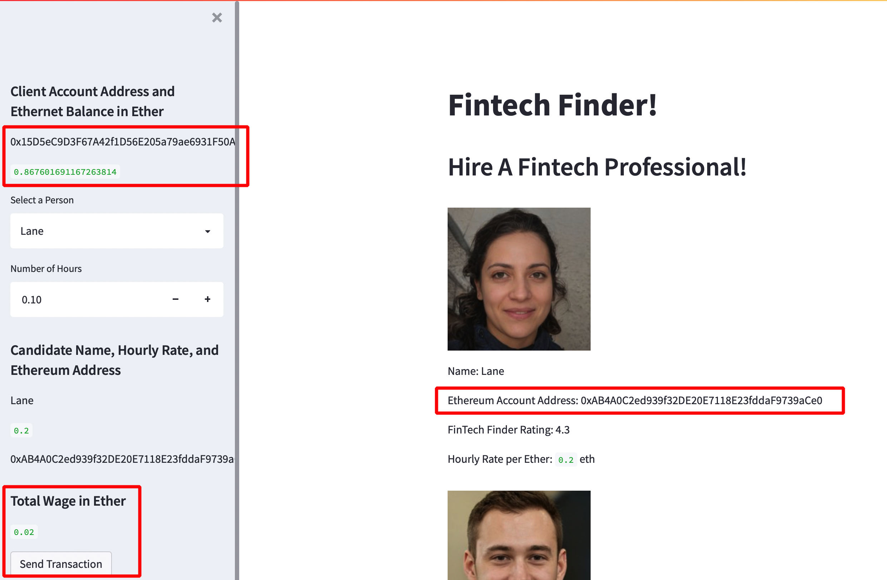
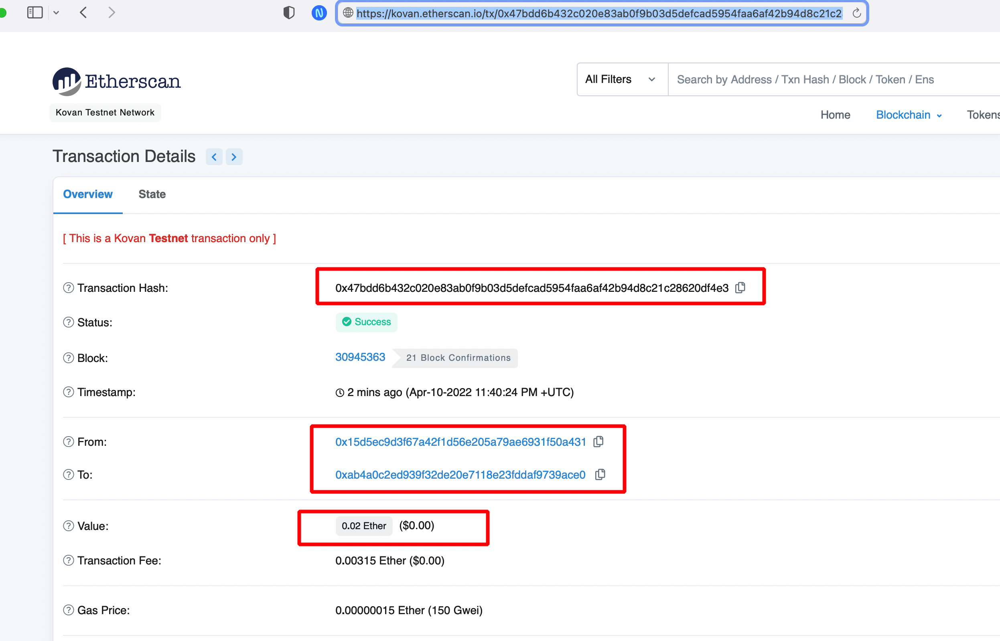
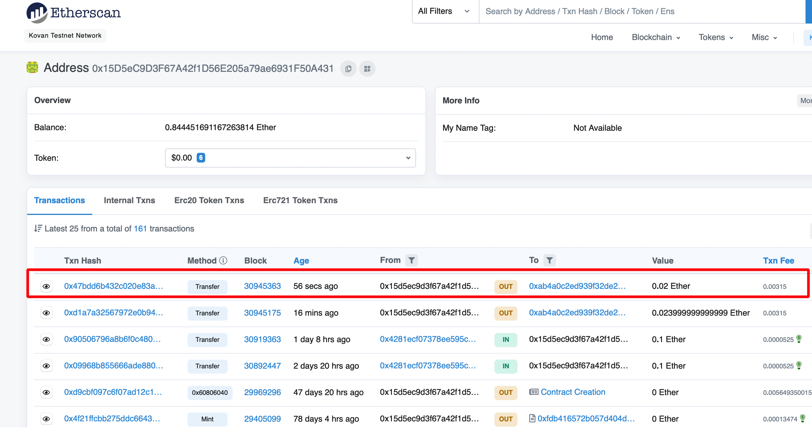

## Fintech application to pay in crypto for employees

### Background

Built a new and disruptive platform called Fintech Finder. Fintech Finder is an application that clients can use to find fintech professionals from among a list of candidates, hire them, and pay them. 

Integrated the Ethereum blockchain network into the application in order to enable customers to instantly pay the fintech professionals whom they hire with cryptocurrency.

### Run app online!

Deployed app is online for live run too - 

https://share.streamlit.io/rchak007/fintechpaycrypto/main/fintech_finder.py

Note - as long as the client test ETH address has some ETH you can pay wages to employees.

### Implementation

#### Streamlit, Python 

Used two Python files, both of which are contained in the main folder.

The first file `fintech_finder.py` contains the code associated with the web interface of your application. The code included in this file is compatible with the Streamlit library. 

The second file  `crypto_wallet.py` contains the Ethereum transaction functions. Import statement integrates the `crypto_wallet.py` Python script into the Fintech Finder interface program that is found in the `fintech_finder.py` file.

Integrating these two files will allow to automate the tasks associated with generating a digital wallet if need be or loading payment wallet account from the mnemonic 12 work seed phrase , accessing Ethereum account balances, and signing and sending transactions via a Kovan Ethereum testnet blockchain.

Specifically, you will assume the perspective of a Fintech Finder customer in order to do the following:

* Generate a new Ethereum account instance by using the mnemonic seed phrase provided by Ganache/Metamask for Kovan testnet.

* Fetch and display the account balance associated with the Ethereum account address.

* Calculate the total value of an Ethereum transaction, including the gas estimate, that pays a Fintech Finder candidate for their work.

* Digitally sign a transaction that pays a Fintech Finder candidate, and send this transaction to the Kovan testnet blockchain.

* Review the transaction hash code associated with the validated blockchain transaction.

The transactions and payments can be validated on Kovan Etherscan explorer.

### Streamlit Web Interface

Here we have Client Ethernet address and balance with some employees and their wages info.

Employee who needs to get paid can be selected and their wages will be shown with number of hours they worked and need to get paid. Employee's Ethereum wallet address is also pre-loaded where they want to get paid to.

There is a Send button - 

### Pay employee in Ethereum

### Validate Transaction Hash on Kovan Etherscan

Once Send transaction is selected then the Ethereum amount will be transferred from Client address to Employees address and a transaction Hash is shown.

This can easily verified on the Kovan Etherscan explorer.

### Client Ethereum address

Client can also easily check their Ethereum wallet address to see payments made etc.

